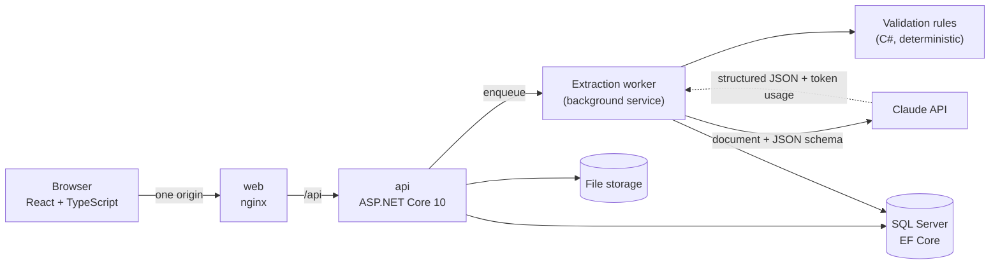

# LLM Invoice Processor

Upload a PDF or photo of an invoice. Claude reads it into a fixed JSON schema, deterministic C# rules check that the numbers add up, and a person reviews the result next to the original document before it is approved.

It is a small, complete example of putting an LLM into a business workflow with the guard rails that takes: structured output instead of parsing free text, validation the model cannot talk its way past, a human in the loop, an eval suite that measures accuracy per field, and cost, token and latency tracking for every call.


_A real run: the invoice is dropped in, Claude reads it in about four seconds, every value on the document lands in the right field, all checks pass, and the reviewer approves it._

## What it does

1. **Upload** a PDF, PNG or JPEG (file type checked by its magic bytes, not its name).
2. **Extraction** runs in the background. The document goes to Claude as native PDF or image input, with a JSON schema as structured output, so the response is always a parseable invoice.
3. **Validation** in plain C#, never by the LLM. Each failed rule flags the fields involved:
   - required fields present (supplier, number, date, currency, net, VAT, total, at least one line)
   - line totals add up to the net, or to the total for invoices that print gross line prices
   - net + VAT = total, within 0.02
   - the date is not in the future
   - the same supplier has not already sent this invoice number
4. **Review.** The document is shown next to the extracted fields, flagged fields are highlighted, and the reviewer corrects them and approves or rejects. Validation re-runs on every save. Missing required data blocks approval; the other rules are warnings, because the reviewer may confirm that an invoice really is inconsistent.
5. **Dashboard** of all invoices, filterable by status and supplier, plus a usage page with cost, tokens and latency per model.

## Architecture



| Project | Responsibility |
|---|---|
| `src/InvoiceProcessor.Core` | Domain model, invoice state transitions, validation rules, the `IInvoiceExtractor` interface. No infrastructure dependencies. |
| `src/InvoiceProcessor.Infrastructure` | EF Core and migrations, file storage, the Anthropic extractor, prompts. |
| `src/InvoiceProcessor.Api` | Minimal API endpoints, background extraction queue, authentication and authorization. |
| `web` | React review UI (Vite, TanStack Query, Tailwind). |
| `evals` | Synthetic invoices with hand-checked expected JSON, and a runner that scores extraction per field. |
| `tests` | Unit tests for the domain, extractor and eval scoring; integration tests for the API. |

## Design decisions

**Structured output, not text parsing.** The extractor sends a strict JSON schema ([`invoice-extraction.schema.json`](src/InvoiceProcessor.Infrastructure/Extraction/Prompts/invoice-extraction.schema.json)) and deserializes the response directly. Refusals and truncated responses are caught and recorded as failures instead of producing half an invoice.

**The model reports, the code judges.** The prompt ([`invoice-extraction.system.md`](src/InvoiceProcessor.Infrastructure/Extraction/Prompts/invoice-extraction.system.md)) tells Claude to transcribe what is printed and never to fix arithmetic. Whether the numbers are consistent is decided by the C# validator, which is unit tested and behaves the same every time.

**Provider behind an interface.** `IInvoiceExtractor` lives in Core; the provider is picked by `Llm:Provider` in configuration, and the model by `Llm:Model`. The eval runner builds the extractor through the same registration code as the API, so it measures exactly what production runs.

**Every call is logged.** Each extraction attempt stores provider, model, input and output tokens, latency, estimated cost (from per-model prices in `appsettings.json`), the raw response and any error. The Usage page aggregates this per model.

**Authentication kept deliberately simple.** ASP.NET Core Identity with an HttpOnly, SameSite=Strict session cookie rather than a JWT in `localStorage`: the React app is served from the API's origin, so the cookie is out of reach of page scripts. Every endpoint requires a signed-in user unless it is explicitly marked anonymous. Two roles:

| | Reviewer | Admin |
|---|:---:|:---:|
| Upload, correct, approve and reject invoices | ✓ | ✓ |
| Usage and cost page | | ✓ |
| Manage users (create, change role, disable, set password) | | ✓ |

Accounts are created by an admin; there is no self-registration. Disabling a user or changing their role reaches their open sessions within a minute, and each approval or rejection records who made it.

## Eval results

The eval suite runs every sample through the real extractor and compares each field with hand-written expected JSON (amounts to the cent, text ignoring case and spacing). It also checks that validation catches the samples that contain deliberate errors and raises nothing on the clean ones.

| Field | claude-opus-5 | claude-sonnet-5 |
|---|---:|---:|
| Supplier, invoice number, date, currency | 100% | 100% |
| Net, VAT, total | 100% | 100% |
| Line items (count, description, quantity, unit price, total) | 100% | 100% |
| **Invoices with every field correct** | **12/12** | **12/12** |
| Deliberate errors flagged by validation | 2/2 | 2/2 |
| Clean invoices without false alarms | 10/10 | 10/10 |
| Average latency | 5.3 s | 4.9 s |
| Average tokens in / out | 3,409 / 368 | 3,409 / 475 |
| Average cost per invoice | $0.026 | $0.012 |

The 12 synthetic invoices cover German, British, US, Turkish and French layouts, gross and net line pricing, discounts, two VAT rates, a multi-page invoice, a scanned-looking image and a page crowded with reference numbers. Both models get all of them right, so on this set Sonnet 5 does the same job at under half the cost. The set is too easy to separate the models; harder samples (blurry photos, handwriting) are the next step.

```powershell
dotnet run --project evals/InvoiceProcessor.Evals -- generate            # re-render the synthetic PDFs/PNGs (needs Edge or Chrome)
dotnet run --project evals/InvoiceProcessor.Evals -- run --model claude-sonnet-5
dotnet run --project evals/InvoiceProcessor.Evals -- report              # the table above, from saved runs
```

A run calls the Claude API, so it costs money (about $0.15–0.35 for the 12 samples).

## Running it

### With Docker (everything in one command)

Requires Docker. Then:

```powershell
git clone https://github.com/sezerturkdal/llm-invoice-processor.git
cd llm-invoice-processor
cp .env.example .env    # set MSSQL_SA_PASSWORD, ADMIN_EMAIL, ADMIN_PASSWORD, ANTHROPIC_API_KEY
docker compose up --build
```

Open http://localhost:8080 and sign in with `ADMIN_EMAIL` / `ADMIN_PASSWORD`. The database is created and migrated on the first start. Without an Anthropic API key the app still runs, but extraction fails and uploads can only be retried or rejected.

### For development

Requires the .NET 10 SDK, Node 22 and Docker (for SQL Server).

```powershell
docker compose up -d sqlserver

cd src/InvoiceProcessor.Api
dotnet user-secrets set "ConnectionStrings:InvoiceProcessor" "Server=localhost,1433;Database=InvoiceProcessor;User Id=sa;Password=<MSSQL_SA_PASSWORD>;TrustServerCertificate=True"
dotnet user-secrets set "Llm:ApiKey" "<your Anthropic API key>"
dotnet run --launch-profile http        # API on http://localhost:5098

cd ../../web
npm install
npm run dev                             # app on http://localhost:5173
```

In development two demo accounts are created: `admin@example.com` and `reviewer@example.com`, both with password `1234` (short passwords are allowed only in the Development environment). The login page fills them in with one click.

### Tests

```powershell
dotnet test        # 115 tests; the API integration tests start SQL Server in Docker via Testcontainers
cd web && npm test
```

The API integration tests host the real application against a throwaway SQL Server and check the access rules end to end: anonymous requests get 401, reviewers get 403 on admin endpoints, disabled users lose their session.

## Tech stack

| Area | Technologies |
|---|---|
| **AI** | Claude (Opus 5 / Sonnet 5) via the official Anthropic C# SDK: native PDF and image input, structured output |
| **Backend** | .NET 10, ASP.NET Core minimal APIs, background service with `System.Threading.Channels` |
| **Database** | SQL Server 2022, EF Core 10 with migrations |
| **Authentication** | ASP.NET Core Identity, cookie authentication, role-based authorization |
| **Frontend** | React 19, TypeScript, Vite, TanStack Query, React Router, Tailwind CSS |
| **Testing** | xUnit, WebApplicationFactory, Testcontainers, Vitest, custom eval runner |
| **Infrastructure** | Docker, Docker Compose, nginx |

## Roadmap

- **Local models:** an Ollama provider behind `IInvoiceExtractor`, with a PDF-to-text step first, compared against Claude in the eval suite.
- **Harder evals:** blurry phone photos, handwritten notes, invoices with missing fields.
- **Ask your invoices:** natural-language questions ("top 3 suppliers by total this year") turned into read-only SQL.
