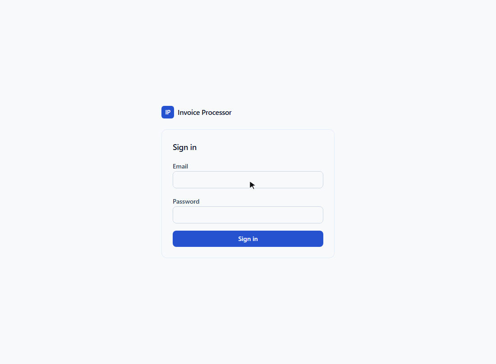
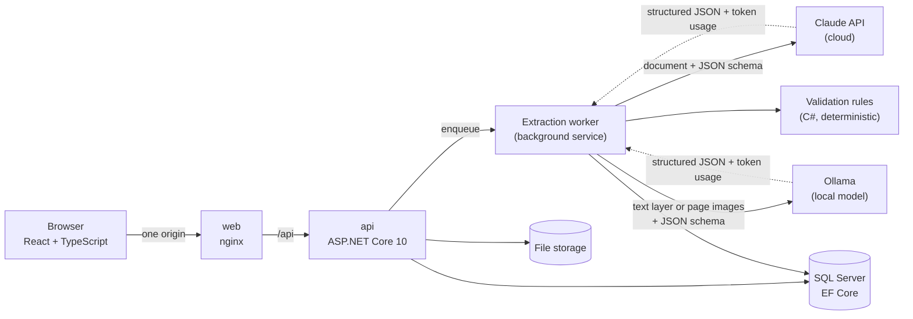
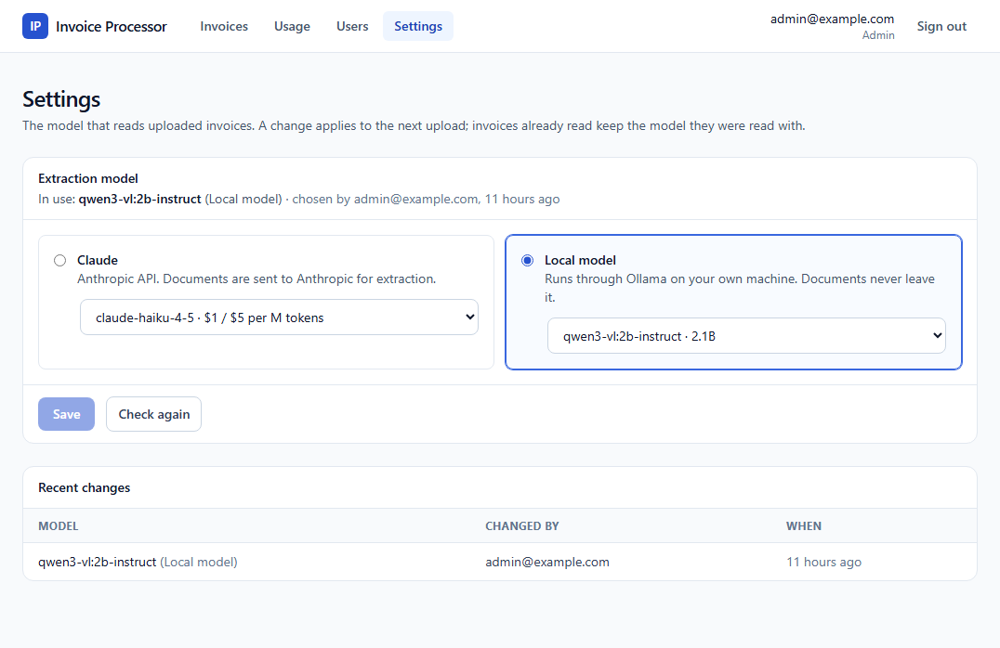

# LLM Invoice Processor

In most companies, supplier invoices are still typed into the system by hand. Every supplier uses a different layout, so someone has to find the invoice number, date, line items and totals on each one and enter them one by one. It takes time, and a mistyped amount or a skipped line leads to inconsistent records that are hard to trace later.

This app automates that step. You drop in an invoice as a PDF or photo, and an AI model reads it, whatever the layout or language, and fills in every field. The app then checks the result itself: whether the lines add up to the total, whether net plus VAT matches, whether the same invoice was already entered. Anything that does not add up is highlighted, and a person compares the fields with the original document, corrects them if needed and approves. Only then is the invoice saved to the database.

- **Your choice of model.** Use Claude, or a model installed on your own computer through Ollama. With a local model, invoices never leave the company, and it keeps working without an internet connection. An admin switches between them in the app.
- **Sign-in and roles.** Users sign in with ASP.NET Core Identity. Reviewers process invoices; admins also manage users, choose the model and see costs.
- **Costs in view.** The Usage page shows what the AI costs per model: tokens, price and response time for every invoice read.
- **Measured, not assumed.** An eval suite scores each model field by field on a set of test invoices, so accuracy can be compared before choosing one.



_A real run: the invoice is dropped in, Claude reads it in about four seconds, every value on the document lands in the right field, all checks pass, and the reviewer approves it._

## What it does

1. **Upload** a PDF, PNG or JPEG (file type checked by its magic bytes, not its name).
2. **Extraction** runs in the background, with a JSON schema as structured output, so the response is always a parseable invoice. Claude gets the document as native PDF or image input. A local model gets the PDF's text layer, or page images when the PDF is a scan.
3. **Validation** in plain C#, never by the LLM. Each failed rule flags the fields involved:
   - required fields present (supplier, number, date, currency, net, VAT, total, at least one line)
   - line totals add up to the net, or to the total for invoices that print gross line prices
   - each line's quantity × unit price matches its line total (catches a misread quantity the sums miss)
   - net + VAT = total, within 0.02
   - the date is not in the future
   - the same supplier has not already sent this invoice number
4. **Review.** The document is shown next to the extracted fields, flagged fields are highlighted, and the reviewer corrects them and approves or rejects. Validation re-runs on every save. Missing required data blocks approval; the other rules are warnings, because the reviewer may confirm that an invoice really is inconsistent.
5. **Dashboard** of all invoices, filterable by status and supplier, plus a usage page with cost, tokens and latency per model.
6. **Settings** for admins: pick Claude or one of the models installed in the local Ollama. The next upload uses it, without a restart.

## Architecture



| Project | Responsibility |
|---|---|
| `src/InvoiceProcessor.Core` | Domain model, invoice state transitions, validation rules, the `IInvoiceExtractor` interface. No infrastructure dependencies. |
| `src/InvoiceProcessor.Infrastructure` | EF Core and migrations, file storage, the Anthropic and Ollama extractors, PDF text and page rendering, prompts. |
| `src/InvoiceProcessor.Api` | Minimal API endpoints, background extraction queue, authentication and authorization. |
| `web` | React review UI (Vite, TanStack Query, Tailwind). |
| `evals` | Synthetic invoices with hand-checked expected JSON, and a runner that scores extraction per field. |
| `tests` | Unit tests for the domain, extractor and eval scoring; integration tests for the API. |

## Design decisions

**Structured output, not text parsing.** The extractor sends a strict JSON schema ([`invoice-extraction.schema.json`](src/InvoiceProcessor.Infrastructure/Extraction/Prompts/invoice-extraction.schema.json)) and deserializes the response directly. Refusals and truncated responses are caught and recorded as failures instead of producing half an invoice.

**The model reports, the code judges.** The prompt ([`invoice-extraction.system.md`](src/InvoiceProcessor.Infrastructure/Extraction/Prompts/invoice-extraction.system.md)) tells Claude to transcribe what is printed and never to fix arithmetic. Whether the numbers are consistent is decided by the C# validator, which is unit tested and behaves the same every time.

**Provider behind an interface, chosen at runtime.** `IInvoiceExtractor` lives in Core, with one implementation per provider. `Llm:Provider` and `Llm:Model` in configuration set the default; an admin can pick another model on the Settings page, and the extractor is resolved per invoice, so the change applies to the next upload. Every change is stored with who made it and when. The eval runner builds the extractor through the same code as the API, so it measures exactly what production runs.



**Configuration decides what is allowed, the app decides what is used.** API keys and the Ollama endpoint stay in configuration and never appear in the UI. `Llm:AllowedProviders` limits what an admin can choose: set it to `["Ollama"]` and no document is ever sent to a cloud API, whatever was picked in the app before.

**Local models, and what it took to make them work.** Ollama models have no native PDF input, so a PDF's text layer is sent as text (exact characters, far fewer tokens than an image), and only scans are rendered to page images. Running a 2B model on a laptop CPU turned up three problems the cloud model hides:

- A model that always "thinks" first spent over ten minutes per invoice on a CPU, and ignored `think: false`; an instruct variant answers directly.
- Constrained to `YYYY-MM-DD`, a small model that copies the printed "12.03.2026" is forced to write "1203-03-20". The local schema leaves the date free, the model transcribes it as printed, and C# converts it, with a fixed rule for ambiguous day/month order. Date accuracy went from 25% to 100%.
- Ollama lists its cloud models next to local ones. They run on Ollama's servers, so they are left out of the picker and refused by the extractor.

A text-only model is not sent images: a scan fails with a clear message instead of an answer made up without seeing the page.

**Every call is logged.** Each extraction attempt stores provider, model, input and output tokens, latency, estimated cost (from per-model prices in `appsettings.json`), the raw response and any error. The Usage page aggregates this per model.

**Authentication kept deliberately simple.** ASP.NET Core Identity with an HttpOnly, SameSite=Strict session cookie rather than a JWT in `localStorage`: the React app is served from the API's origin, so the cookie is out of reach of page scripts. Every endpoint requires a signed-in user unless it is explicitly marked anonymous. Two roles:

| | Reviewer | Admin |
|---|:---:|:---:|
| Upload, correct, approve and reject invoices | ✓ | ✓ |
| Usage and cost page | | ✓ |
| Manage users (create, change role, disable, set password) | | ✓ |
| Choose the extraction model | | ✓ |

Accounts are created by an admin; there is no self-registration. Disabling a user or changing their role reaches their open sessions within a minute, and each approval or rejection records who made it.

## Eval results

The eval suite runs every sample through the real extractor and compares each field with hand-written expected JSON (amounts to the cent, text ignoring case and spacing). It also checks what validation does with the result: it must catch the samples with deliberate errors, raise nothing on clean samples the model read correctly, and flag the ones the model misread.

| Field | claude-opus-5 | claude-sonnet-5 | qwen3-vl:2b-instruct (local) |
|---|---:|---:|---:|
| Supplier, date, currency, net, total | 100% | 100% | 100% |
| Invoice number | 100% | 100% | 83% |
| VAT | 100% | 100% | 92% |
| Line count | 100% | 100% | 83% |
| Line quantity | 100% | 100% | 69% |
| Line description, unit price, total | 100% | 100% | 75% |
| **Invoices with every field correct** | **12/12** | **12/12** | **5/12** |
| Deliberate errors flagged by validation | 2/2 | 2/2 | 2/2 |
| Clean invoices without false alarms | 10/10 | 10/10 | 10/10 |
| Misread invoices flagged for review | – | – | 6/7 |
| Average latency | 5.3 s | 4.9 s | 54.5 s |
| Average tokens in / out | 3,409 / 368 | 3,409 / 475 | 947 / 311 |
| Average cost per invoice | $0.026 | $0.012 | $0 |

The 12 synthetic invoices cover German, British, US, Turkish and French layouts, gross and net line pricing, discounts, two VAT rates, a multi-page invoice, a scanned-looking image and a page crowded with reference numbers.

- **Claude:** both models get every invoice right, so on this set Sonnet 5 does the same job at under half the cost. The set is too easy to separate them; harder samples (blurry photos, handwriting) are the next step.
- **Local 2B model** (CPU only, on a laptop): headers and totals are reliable; line items are where it slips. Most of the line errors come from one invoice, where it stopped after 16 of 32 lines. The scanned image took six minutes, the text PDFs 11–33 seconds. What makes it usable is the layer around it: validation flagged 6 of the 7 invoices it misread (the seventh read "Facture F-2026-0092" for "F-2026-0092"), and the reviewer corrects them before approval.

```powershell
dotnet run --project evals/InvoiceProcessor.Evals -- generate            # re-render the synthetic PDFs/PNGs (needs Edge or Chrome)
dotnet run --project evals/InvoiceProcessor.Evals -- run --model claude-sonnet-5
dotnet run --project evals/InvoiceProcessor.Evals -- run --provider Ollama --model qwen3-vl:2b-instruct
dotnet run --project evals/InvoiceProcessor.Evals -- report              # the table above, from saved runs
```

A Claude run costs money (about $0.15–0.35 for the 12 samples); an Ollama run is free but slow on a CPU (about 12 minutes here).

## Running it

### With Docker (everything in one command)

Requires Docker. Then:

```powershell
git clone https://github.com/sezerturkdal/llm-invoice-processor.git
cd llm-invoice-processor
cp .env.example .env    # set MSSQL_SA_PASSWORD, ADMIN_EMAIL, ADMIN_PASSWORD, ANTHROPIC_API_KEY
docker compose up --build
```

Open http://localhost:8080 and sign in with `ADMIN_EMAIL` / `ADMIN_PASSWORD`. The database is created and migrated on the first start. Without an Anthropic API key the app still runs, but extraction fails and uploads can only be retried or rejected.

### For development

Requires the .NET 10 SDK, Node 22 and Docker (for SQL Server).

```powershell
docker compose up -d sqlserver

cd src/InvoiceProcessor.Api
dotnet user-secrets set "ConnectionStrings:InvoiceProcessor" "Server=localhost,1433;Database=InvoiceProcessor;User Id=sa;Password=<MSSQL_SA_PASSWORD>;TrustServerCertificate=True"
dotnet user-secrets set "Llm:ApiKey" "<your Anthropic API key>"
dotnet run --launch-profile http        # API on http://localhost:5098

cd ../../web
npm install
npm run dev                             # app on http://localhost:5173
```

In development two demo accounts are created: `admin@example.com` and `reviewer@example.com`, both with password `1234` (short passwords are allowed only in the Development environment). The login page fills them in with one click.

### With a local model (no API key, no document leaves the machine)

Install [Ollama](https://ollama.com) and a vision model, then pick it on the Settings page as an admin:

```powershell
ollama pull qwen3-vl:2b-instruct     # 1.9 GB, runs on a laptop CPU; larger models read more accurately
```

With Docker, `docker compose --profile local up --build` also starts an `ollama` container (pull the model into it with `docker compose exec ollama ollama pull qwen3-vl:2b-instruct`), or point `OLLAMA_ENDPOINT` in `.env` at an Ollama already running on the host. Once the model is downloaded, extraction works offline.

Settings under `Llm:Ollama` in `appsettings.json`: `Endpoint`, `ContextLength`, `TimeoutSeconds`, and `Threads` (on a CPU with efficiency cores Ollama may use only the performance ones; setting all cores gave about 20% more speed here).

### Tests

```powershell
dotnet test        # the API integration tests start SQL Server in Docker via Testcontainers
cd web && npm test
```

The API integration tests host the real application against a throwaway SQL Server and check the access rules end to end: anonymous requests get 401, reviewers get 403 on admin endpoints, disabled users lose their session.

## Tech stack

| Area | Technologies |
|---|---|
| **AI** | Claude (Opus 5 / Sonnet 5) via the official Anthropic C# SDK: native PDF and image input, structured output. Local models (Qwen3-VL) via the Ollama REST API |
| **Documents** | PdfPig (PDF text layer), PDFtoImage (rendering scanned pages) |
| **Backend** | .NET 10, ASP.NET Core minimal APIs, background service with `System.Threading.Channels` |
| **Database** | SQL Server 2022, EF Core 10 with migrations |
| **Authentication** | ASP.NET Core Identity, cookie authentication, role-based authorization |
| **Frontend** | React 19, TypeScript, Vite, TanStack Query, React Router, Tailwind CSS |
| **Testing** | xUnit, WebApplicationFactory, Testcontainers, Vitest, custom eval runner |
| **Infrastructure** | Docker, Docker Compose, nginx |

## Roadmap

- **Harder evals:** blurry phone photos, handwritten notes, invoices with missing fields.
- **Larger local models:** the 2B model shows the pipeline working; an 8B instruct model on a machine with a supported GPU should close much of the gap to Claude.
- **Ask your invoices:** natural-language questions ("top 3 suppliers by total this year") turned into read-only SQL.
